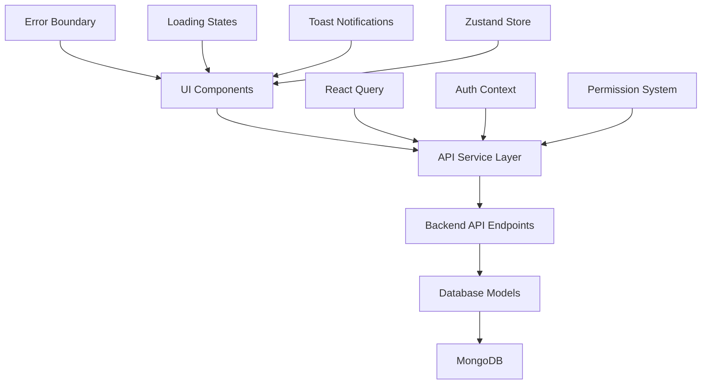

# Technical Specification: Mock Data to Real Backend Integration

## Executive Summary

This document outlines the comprehensive plan for transitioning the Winrich Dynamic CRM system from mock data to real backend integration. The transition will be executed in three phases, ensuring minimal disruption while maintaining system functionality and data integrity.

## 1. Data Model Design

### 1.1 Project Model Schema (New)

The Project model is currently missing from the backend and needs to be created to support the Projects functionality.

```typescript
// src/models/Project.ts
export interface IProject extends Document {
  projectCode: string; // Auto-generated: PJ#YYMMDD-XXXX
  name: string;
  type: string; // Project type (e.g., "หอพัก / คอนโดมิเนียม / ที่พักอาศัยแนวสูง")
  customerId: string; // Reference to Customer
  customerName: string; // Denormalized for performance
  tags: string[];
  importance: number; // 1-5 scale
  quotationCount: number; // Calculated field
  activityCount: number; // Calculated field
  startDate: Date;
  endDate: Date;
  value: number; // Project value in THB
  ownerId: string; // Admin ID from token
  ownerName: string; // Denormalized for display
  team: string; // Team assignment
  status: 'planning' | 'proposed' | 'quoted' | 'testing' | 'approved' | 'closed';
  description?: string;
  location?: {
    address: string;
    province: string;
    district: string;
    subdistrict: string;
    zipcode: string;
  };
  createdAt: Date;
  updatedAt: Date;
}
```

### 1.2 Forecast Data Model

The Forecast functionality requires a new model to track sales predictions and targets.

```typescript
// src/models/Forecast.ts
export interface IForecast extends Document {
  period: string; // Format: YYYY-MM (e.g., "2025-10")
  ownerId?: string; // Admin ID for personal forecasts
  team?: string; // Team for team forecasts
  targetType: 'revenue' | 'units' | 'customers' | 'opportunities';
  targetValue: number; // Target amount
  actualValue: number; // Actual achieved value
  confidence: number; // 0-100 confidence level
  products: Array<{
    productId: string;
    productName: string;
    targetQuantity: number;
    actualQuantity: number;
    unitPrice: number;
  }>;
  opportunities: Array<{
    opportunityId: string;
    opportunityName: string;
    probability: number; // 0-100
    expectedValue: number;
    expectedCloseDate: Date;
  }>;
  notes?: string;
  createdAt: Date;
  updatedAt: Date;
}
```

### 1.3 Enhanced Opportunity Model

The current mock opportunities need to be mapped to the existing Deal model with enhancements.

```typescript
// Extension to existing Deal model
export interface IDeal extends Document {
  // ... existing fields ...
  
  // New fields for opportunity functionality
  opportunityCode: string; // Auto-generated: LD#YYMMDD-XXXX
  contactPerson: string;
  contactPhone: string;
  contactEmail?: string;
  products: Array<{
    productId: string;
    productName: string;
    quantity: number;
    unitPrice: number;
  }>;
  likes: number; // Social proof feature
  source: 'cold_call' | 'referral' | 'website' | 'existing_customer' | 'other';
  temperature: 'cold' | 'warm' | 'hot';
  nextAction?: string;
  nextActionDate?: Date;
}
```

### 1.4 Data Model Mapping

| Mock Data Field | Backend Model Field | Notes |
|----------------|-------------------|-------|
| mockProjects.id | Project._id | Convert to ObjectId |
| mockProjects.code | Project.projectCode | Maintain format PJ#YYMMDD-XXXX |
| mockProjects.customerId | Project.customerId | Reference to Customer |
| mockProjects.importance | Project.importance | 1-5 scale |
| mockProjects.status | Project.status | Map to enum values |
| mockOpportunities.id | Deal._id | Convert to ObjectId |
| mockOpportunities.code | Deal.opportunityCode | Maintain format LD#YYMMDD-XXXX |
| mockOpportunities.products | Deal.products | Array structure |
| mockOpportunities.likes | Deal.likes | Social proof feature |

## 2. API Endpoint Specifications

### 2.1 Projects API Endpoints

#### GET /api/projects
```typescript
// Query Parameters
interface GetProjectsQuery {
  page?: number;
  limit?: number;
  q?: string; // Search term
  customerId?: string;
  ownerId?: string;
  team?: string;
  status?: string;
  importance?: number;
  dateFrom?: string;
  dateTo?: string;
}

// Response
interface GetProjectsResponse {
  data: IProject[];
  total: number;
  page: number;
  limit: number;
  totalPages: number;
}
```

#### POST /api/projects
```typescript
// Request Body
interface CreateProjectRequest {
  name: string;
  type: string;
  customerId: string;
  tags?: string[];
  importance?: number;
  startDate: string;
  endDate?: string;
  value?: number;
  team?: string;
  status?: string;
  description?: string;
  location?: {
    address: string;
    province: string;
    district: string;
    subdistrict: string;
    zipcode: string;
  };
}

// Response
interface CreateProjectResponse {
  success: boolean;
  data: IProject;
  message: string;
}
```

#### PUT /api/projects/[id]
```typescript
// Request Body
interface UpdateProjectRequest {
  name?: string;
  type?: string;
  customerId?: string;
  tags?: string[];
  importance?: number;
  startDate?: string;
  endDate?: string;
  value?: number;
  status?: string;
  description?: string;
  location?: LocationData;
}
```

#### DELETE /api/projects/[id]
```typescript
// Response
interface DeleteProjectResponse {
  success: boolean;
  message: string;
}
```

### 2.2 Forecast API Endpoints

#### GET /api/forecasts
```typescript
// Query Parameters
interface GetForecastsQuery {
  period?: string; // YYYY-MM format
  ownerId?: string;
  team?: string;
  targetType?: string;
}

// Response
interface GetForecastsResponse {
  data: IForecast[];
  summary: {
    totalTarget: number;
    totalActual: number;
    achievementRate: number;
  };
}
```

#### POST /api/forecasts
```typescript
// Request Body
interface CreateForecastRequest {
  period: string;
  targetType: 'revenue' | 'units' | 'customers' | 'opportunities';
  targetValue: number;
  confidence?: number;
  products?: Array<{
    productId: string;
    targetQuantity: number;
    unitPrice: number;
  }>;
  opportunities?: Array<{
    opportunityId: string;
    probability: number;
    expectedValue: number;
    expectedCloseDate: string;
  }>;
  notes?: string;
}
```

#### PUT /api/forecasts/[id]
```typescript
// Request Body
interface UpdateForecastRequest {
  targetValue?: number;
  actualValue?: number;
  confidence?: number;
  products?: ForecastProduct[];
  opportunities?: ForecastOpportunity[];
  notes?: string;
}
```

### 2.3 Enhanced Opportunities API

#### GET /api/opportunities
```typescript
// Query Parameters
interface GetOpportunitiesQuery {
  page?: number;
  limit?: number;
  q?: string;
  customerId?: string;
  ownerId?: string;
  status?: string;
  temperature?: string;
  source?: string;
  dateFrom?: string;
  dateTo?: string;
}
```

#### POST /api/opportunities
```typescript
// Request Body
interface CreateOpportunityRequest {
  title: string;
  customerId: string;
  amount: number;
  contactPerson: string;
  contactPhone: string;
  contactEmail?: string;
  products: Array<{
    productId: string;
    quantity: number;
    unitPrice: number;
  }>;
  source?: string;
  temperature?: string;
  expectedCloseDate?: string;
  notes?: string;
}
```

## 3. UI Component Architecture

### 3.1 Project Modal/Form Component

```typescript
// src/components/ProjectModal.tsx
interface ProjectModalProps {
  isOpen: boolean;
  onClose: () => void;
  project?: IProject; // For edit mode
  onSave: (project: Partial<IProject>) => Promise<void>;
  mode: 'create' | 'edit';
}

interface ProjectFormData {
  name: string;
  type: string;
  customerId: string;
  tags: string[];
  importance: number;
  startDate: Date;
  endDate?: Date;
  value: number;
  team: string;
  status: ProjectStatus;
  description: string;
  location: LocationData;
}
```

**Key Features:**
- Customer selection with search
- Project type dropdown with predefined options
- Importance rating (1-5 stars)
- Date range picker
- Value input with currency formatting
- Location autocomplete
- Tag management
- Status workflow buttons

### 3.2 Activity Modal Component

```typescript
// src/components/ActivityModal.tsx
interface ActivityModalProps {
  isOpen: boolean;
  onClose: () => void;
  activity?: IActivity;
  onSave: (activity: Partial<IActivity>) => Promise<void>;
  relatedEntity?: {
    type: 'customer' | 'deal' | 'quotation' | 'project';
    id: string;
  };
}

interface ActivityFormData {
  type: ActivityType;
  subject: string;
  notes: string;
  scheduledAt?: Date;
  remindBeforeMinutes?: number;
  customerId?: string;
  dealId?: string;
  quotationId?: string;
  projectId?: string;
}
```

**Key Features:**
- Activity type selection (call, meeting, email, task)
- Rich text notes editor
- Date/time scheduler
- Reminder settings
- Related entity linking
- Recurring activity options

### 3.3 Opportunity Modal Component

```typescript
// src/components/OpportunityModal.tsx
interface OpportunityModalProps {
  isOpen: boolean;
  onClose: () => void;
  opportunity?: IDeal;
  onSave: (opportunity: Partial<IDeal>) => Promise<void>;
  customerId?: string; // Pre-selected customer
}

interface OpportunityFormData {
  title: string;
  customerId: string;
  amount: number;
  contactPerson: string;
  contactPhone: string;
  contactEmail?: string;
  products: OpportunityProduct[];
  source: OpportunitySource;
  temperature: OpportunityTemperature;
  expectedCloseDate?: Date;
  stageId: string;
  probability: number;
  notes: string;
}
```

**Key Features:**
- Customer selection with search
- Product selection with pricing
- Contact information form
- Source tracking
- Temperature rating
- Probability slider
- Stage selection
- Value calculation

### 3.4 Data Flow Architecture



## 4. Implementation Phases

### 4.1 Phase 1: Direct Replacements (Week 1-2)

**Objective**: Replace mock data with real API calls for existing functionality

**Tasks**:
1. **Customers Integration**
   - Update DataContext to use API calls instead of mock data
   - Implement React Query for data fetching
   - Add error handling and loading states
   - Update CustomerForm to use real API

2. **Activities Integration**
   - Connect Activities page to `/api/activities`
   - Implement activity creation and editing
   - Add activity filtering and search
   - Update ActivityTimeline component

3. **Quotations Integration**
   - Connect Quotations page to `/api/quotations`
   - Implement quotation status management
   - Add quotation PDF generation
   - Update QuotationForm component

**Deliverables**:
- Fully functional Customers, Activities, and Quotations pages
- API service layer with error handling
- Loading states and user feedback
- Basic data validation

### 4.2 Phase 2: Feature Parity (Week 3-4)

**Objective**: Implement missing features to match mock data functionality

**Tasks**:
1. **Projects Implementation**
   - Create Project model and API endpoints
   - Implement Projects page with full CRUD operations
   - Create ProjectModal component
   - Add project filtering and search
   - Implement project status workflow

2. **Opportunities Enhancement**
   - Extend Deal model for opportunity functionality
   - Create OpportunityModal component
   - Implement opportunity management
   - Add opportunity scoring and tracking
   - Connect to existing Deals API

3. **Sales Orders Integration**
   - Connect SalesOrders page to `/api/orders`
   - Implement order status tracking
   - Add order fulfillment features
   - Update SalesOrderForm component

**Deliverables**:
- Complete Projects functionality
- Enhanced Opportunities management
- Full Sales Orders integration
- Advanced filtering and search capabilities

### 4.3 Phase 3: Advanced Features (Week 5-6)

**Objective**: Implement advanced features and optimizations

**Tasks**:
1. **Forecast Implementation**
   - Create Forecast model and API endpoints
   - Implement Forecast page with analytics
   - Add forecast vs actual tracking
   - Create forecast visualization charts
   - Implement team and personal forecasts

2. **Reports Enhancement**
   - Connect Reports page to real data
   - Implement dynamic report generation
   - Add export functionality (CSV, PDF)
   - Create custom report builder
   - Add scheduled reports

3. **Settings and Configuration**
   - Implement system settings management
   - Add user preferences
   - Create notification settings
   - Implement data import/export
   - Add audit trail functionality

**Deliverables**:
- Complete Forecast functionality
- Advanced reporting system
- Comprehensive settings management
- Data import/export capabilities

## 5. Technical Considerations

### 5.1 Error Handling Strategies

```typescript
// API Service Layer Error Handling
class APIError extends Error {
  constructor(
    message: string,
    public status: number,
    public code?: string,
    public details?: any
  ) {
    super(message);
    this.name = 'APIError';
  }
}

// Error Boundary Component
class ErrorBoundary extends React.Component {
  constructor(props) {
    super(props);
    this.state = { hasError: false, error: null };
  }

  static getDerivedStateFromError(error) {
    return { hasError: true, error };
  }

  componentDidCatch(error, errorInfo) {
    console.error('Error caught by boundary:', error, errorInfo);
    // Log to monitoring service
  }

  render() {
    if (this.state.hasError) {
      return <ErrorFallback error={this.state.error} />;
    }
    return this.props.children;
  }
}
```

### 5.2 Loading States and User Feedback

```typescript
// Loading States with React Query
const useProjects = (filters) => {
  return useQuery({
    queryKey: ['projects', filters],
    queryFn: () => fetchProjects(filters),
    staleTime: 5 * 60 * 1000, // 5 minutes
    cacheTime: 10 * 60 * 1000, // 10 minutes
  });
};

// Loading Component
const LoadingSpinner = ({ size = 'md' }) => (
  <div className={`flex justify-center items-center ${sizeClasses[size]}`}>
    <div className="animate-spin rounded-full border-2 border-gray-300 border-t-blue-600"></div>
  </div>
);

// Toast Notifications
const useToast = () => {
  const [toasts, setToasts] = useState([]);
  
  const addToast = (message, type = 'info') => {
    const id = Date.now();
    setToasts(prev => [...prev, { id, message, type }]);
    setTimeout(() => {
      setToasts(prev => prev.filter(toast => toast.id !== id));
    }, 5000);
  };
  
  return { addToast, toasts };
};
```

### 5.3 Authentication and Authorization

```typescript
// Auth Context
const AuthContext = createContext();

export const AuthProvider = ({ children }) => {
  const [user, setUser] = useState(null);
  const [loading, setLoading] = useState(true);
  
  useEffect(() => {
    const token = getAuthToken();
    if (token) {
      validateToken(token).then(setUser).finally(() => setLoading(false));
    } else {
      setLoading(false);
    }
  }, []);
  
  const login = async (credentials) => {
    const response = await loginAPI(credentials);
    setAuthToken(response.token);
    setUser(response.user);
  };
  
  const logout = () => {
    removeAuthToken();
    setUser(null);
  };
  
  return (
    <AuthContext.Provider value={{ user, login, logout, loading }}>
      {children}
    </AuthContext.Provider>
  );
};

// Permission System
const usePermissions = () => {
  const { user } = useContext(AuthContext);
  
  const hasPermission = (permission) => {
    return user?.permissions?.includes(permission) || user?.role === 'admin';
  };
  
  const canAccess = (resource, action) => {
    const permission = `${resource}:${action}`;
    return hasPermission(permission);
  };
  
  return { hasPermission, canAccess };
};
```

### 5.4 Data Validation Approaches

```typescript
// Zod Schemas for Validation
import { z } from 'zod';

const ProjectSchema = z.object({
  name: z.string().min(1, 'Project name is required').max(200),
  type: z.string().min(1, 'Project type is required'),
  customerId: z.string().min(1, 'Customer is required'),
  importance: z.number().min(1).max(5),
  startDate: z.date(),
  endDate: z.date().optional(),
  value: z.number().min(0),
  team: z.string().optional(),
  status: z.enum(['planning', 'proposed', 'quoted', 'testing', 'approved', 'closed']),
  description: z.string().max(2000).optional(),
  location: z.object({
    address: z.string(),
    province: z.string(),
    district: z.string(),
    subdistrict: z.string(),
    zipcode: z.string().regex(/^\d{5}$/),
  }).optional(),
});

// Form Validation Hook
const useFormValidation = (schema) => {
  const [errors, setErrors] = useState({});
  
  const validate = (data) => {
    try {
      schema.parse(data);
      setErrors({});
      return true;
    } catch (error) {
      if (error instanceof z.ZodError) {
        const fieldErrors = {};
        error.errors.forEach(err => {
          fieldErrors[err.path[0]] = err.message;
        });
        setErrors(fieldErrors);
      }
      return false;
    }
  };
  
  return { errors, validate };
};
```

## 6. Performance Optimizations

### 6.1 Data Fetching Optimizations

```typescript
// React Query Configuration
const queryClient = new QueryClient({
  defaultOptions: {
    queries: {
      staleTime: 5 * 60 * 1000, // 5 minutes
      cacheTime: 10 * 60 * 1000, // 10 minutes
      retry: 3,
      retryDelay: attemptIndex => Math.min(1000 * 2 ** attemptIndex, 30000),
    },
  },
});

// Pagination with Infinite Scroll
const useInfiniteProjects = (filters) => {
  return useInfiniteQuery({
    queryKey: ['projects', 'infinite', filters],
    queryFn: ({ pageParam = 1 }) => fetchProjects({ ...filters, page: pageParam }),
    getNextPageParam: (lastPage, allPages) => {
      if (lastPage.page < lastPage.totalPages) {
        return lastPage.page + 1;
      }
      return undefined;
    },
  });
};
```

### 6.2 Component Optimization

```typescript
// Memoized Components
const ProjectCard = React.memo(({ project, onEdit, onDelete }) => {
  return (
    <div className="project-card">
      {/* Card content */}
    </div>
  );
}, (prevProps, nextProps) => {
  return prevProps.project._id === nextProps.project._id &&
         prevProps.project.updatedAt === nextProps.project.updatedAt;
});

// Virtual Scrolling for Large Lists
import { FixedSizeList as List } from 'react-window';

const ProjectList = ({ projects }) => {
  const Row = ({ index, style }) => (
    <div style={style}>
      <ProjectCard project={projects[index]} />
    </div>
  );
  
  return (
    <List
      height={600}
      itemCount={projects.length}
      itemSize={120}
    >
      {Row}
    </List>
  );
};
```

## 7. Testing Strategy

### 7.1 Unit Testing

```typescript
// Component Testing
import { render, screen, fireEvent } from '@testing-library/react';
import { ProjectModal } from './ProjectModal';

describe('ProjectModal', () => {
  it('should render form fields correctly', () => {
    render(<ProjectModal isOpen={true} onClose={() => {}} onSave={() => {}} mode="create" />);
    
    expect(screen.getByLabelText('Project Name')).toBeInTheDocument();
    expect(screen.getByLabelText('Project Type')).toBeInTheDocument();
    expect(screen.getByLabelText('Customer')).toBeInTheDocument();
  });
  
  it('should validate form submission', async () => {
    const mockSave = jest.fn();
    render(<ProjectModal isOpen={true} onClose={() => {}} onSave={mockSave} mode="create" />);
    
    fireEvent.click(screen.getByText('Save'));
    
    expect(screen.getByText('Project name is required')).toBeInTheDocument();
    expect(mockSave).not.toHaveBeenCalled();
  });
});
```

### 7.2 Integration Testing

```typescript
// API Integration Testing
import { renderHook, waitFor } from '@testing-library/react';
import { QueryClient, QueryClientProvider } from 'react-query';
import { useProjects } from './useProjects';

describe('useProjects', () => {
  it('should fetch projects successfully', async () => {
    const queryClient = new QueryClient();
    const wrapper = ({ children }) => (
      <QueryClientProvider client={queryClient}>{children}</QueryClientProvider>
    );
    
    const { result } = renderHook(() => useProjects(), { wrapper });
    
    await waitFor(() => {
      expect(result.current.isSuccess).toBe(true);
      expect(result.current.data).toHaveLength(3);
    });
  });
});
```

## 8. Deployment Considerations

### 8.1 Environment Configuration

```typescript
// Environment Variables
const config = {
  apiUrl: process.env.NEXT_PUBLIC_API_URL,
  mongodbUri: process.env.MONGODB_URI,
  jwtSecret: process.env.JWT_SECRET,
  uploadUrl: process.env.NEXT_PUBLIC_UPLOAD_URL,
  maxFileSize: parseInt(process.env.MAX_FILE_SIZE || '10485760'),
  enableDebug: process.env.NODE_ENV === 'development',
};

// API Configuration
const apiConfig = {
  timeout: 30000,
  retries: 3,
  retryDelay: 1000,
  headers: {
    'Content-Type': 'application/json',
  },
};
```

### 8.2 Database Migration Strategy

```typescript
// Migration Script
const migrateMockData = async () => {
  // 1. Create new collections
  await createProjectCollection();
  await createForecastCollection();
  
  // 2. Migrate existing data
  await migrateCustomers();
  await migrateQuotations();
  await migrateActivities();
  
  // 3. Create indexes
  await createIndexes();
  
  // 4. Validate data integrity
  await validateData();
};
```

## 9. Monitoring and Analytics

### 9.1 Performance Monitoring

```typescript
// Performance Monitoring
const trackPageView = (page) => {
  if (typeof window !== 'undefined' && window.gtag) {
    window.gtag('config', 'GA_MEASUREMENT_ID', {
      page_path: page,
    });
  }
};

const trackUserAction = (action, category, label) => {
  if (typeof window !== 'undefined' && window.gtag) {
    window.gtag('event', action, {
      event_category: category,
      event_label: label,
    });
  }
};
```

### 9.2 Error Tracking

```typescript
// Error Tracking with Sentry
import * as Sentry from '@sentry/nextjs';

Sentry.init({
  dsn: process.env.NEXT_PUBLIC_SENTRY_DSN,
  environment: process.env.NODE_ENV,
});

const trackError = (error, context) => {
  Sentry.captureException(error, {
    contexts: {
      custom: context,
    },
  });
};
```

## 10. Conclusion

This comprehensive specification provides a detailed roadmap for transitioning from mock data to real backend integration. The phased approach ensures minimal disruption while maintaining system functionality and data integrity.

Key success factors:
1. **Incremental Implementation**: Phase-based rollout reduces risk
2. **Robust Error Handling**: Comprehensive error management ensures good UX
3. **Performance Optimization**: Efficient data fetching and component rendering
4. **Thorough Testing**: Unit and integration tests ensure reliability
5. **Monitoring**: Performance and error tracking for proactive issue resolution

The implementation should follow this specification closely while allowing for flexibility based on real-world feedback and requirements.